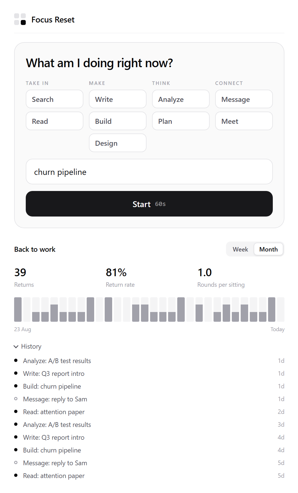
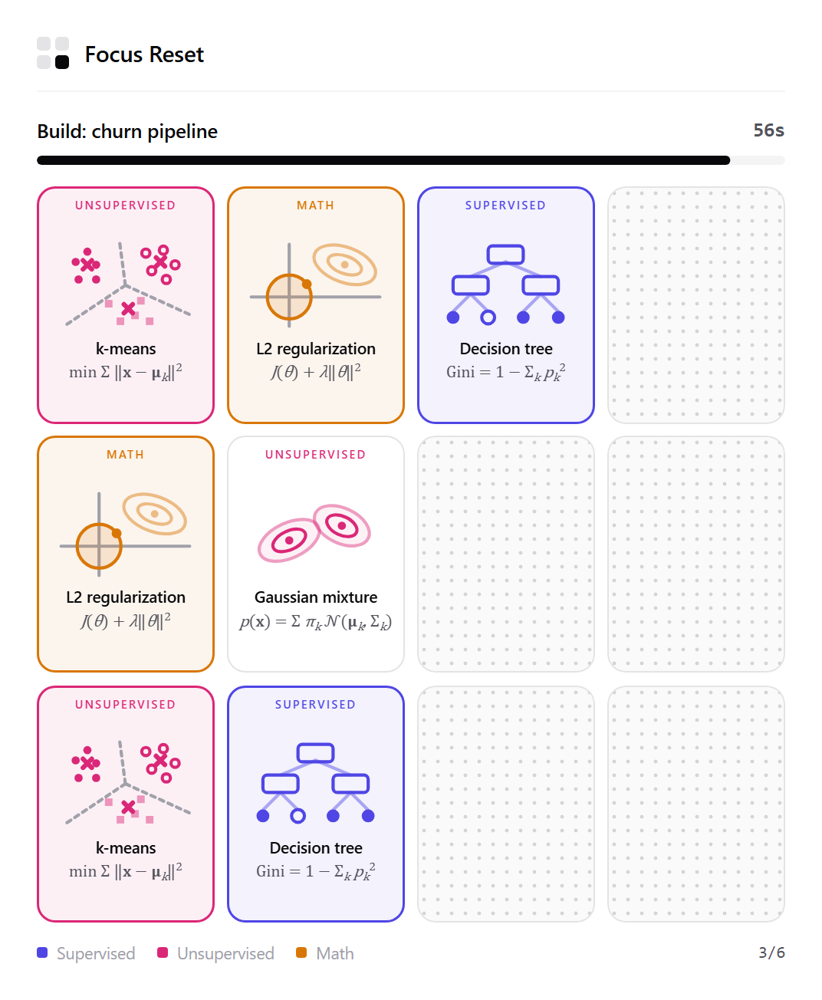
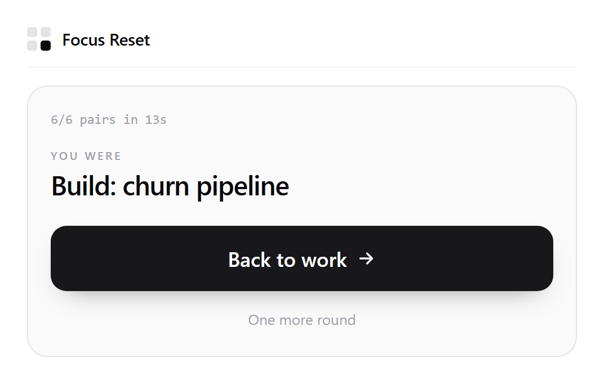

# Focus Reset

A one-round memory game for the moment you feel like drifting off task. You say what
you were doing, play a single 60-second round, and get sent back to it.

It runs as a Chrome extension (toolbar popup and new-tab page) or as a plain web page.

<p>
  
  
  
</p>

## How it works

1. **Name the task.** Pick what you were doing (Search, Read, Write, Build, Design,
   Analyze, Plan, Message, Meet) and optionally add a detail.
2. **Play one round.** Six pairs, 60 seconds from the first flip. Cards show machine
   learning algorithms and the math behind them, grouped as Supervised, Unsupervised
   and Math.
3. **Go back.** The end screen shows your task and one main button: Back to work.

Replaying is possible but deliberately slower: the second round in a sitting asks first,
and from the third round on you wait a few seconds before you can start.

## Tracking

The stats panel counts returns to work, not scores:

- **Returns**: rounds that ended with Back to work
- **Return rate**: share of rounds that ended that way
- **Rounds per sitting**: should stay close to 1
- Daily chart for the last 7 or 30 days, plus a history of your task notes

All data stays in your browser (`chrome.storage.local` in the extension,
`localStorage` on the web). Nothing is sent anywhere.

## Install

**Chrome extension**

1. Clone or download this repository.
2. Open `chrome://extensions` and turn on **Developer mode**.
3. Click **Load unpacked** and select the repository folder.

The extension replaces the new-tab page. To keep your usual new tab, remove the
`chrome_url_overrides` entry from `manifest.json` and use the toolbar popup only.

**Web**

Open `index.html` in a browser, or serve the folder with GitHub Pages (no build step).

## Project structure

```
manifest.json      Chrome extension manifest (MV3, storage permission only)
index.html         Web version
popup.html         Toolbar popup
newtab.html        New-tab page
src/app.js         Game, eject flow, tracking, stats
src/cards.js       Card content: illustrations and formulas
src/styles.css     Styles, light and dark
icons/             Extension icons (16, 48, 128)
```

The three HTML pages share the same code; `<body data-surface="...">` tells the app
where it is running.

## Configuration

Round length, board size, sitting length and friction delays are in `CONFIG` at the top
of `src/app.js`. Activities are in `ACTIVITIES` in the same file. To add a card, append
an entry to `FR_CARDS` in `src/cards.js`.

## License

[MIT](LICENSE)
